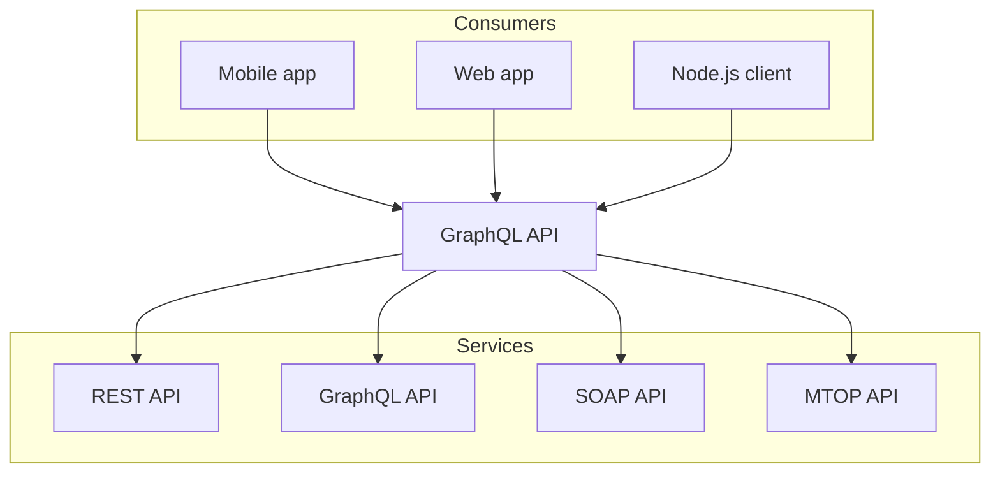

# If

## Link

- https://mirreal.net/
  - https://thought.mirreal.net/ gitlab mirror
  - https://mirreal.github.io/ github pages
- https://wiki.mirreal.net/ wiki site
- https://astro.mirreal.net/ astro blog site
- https://blog.mirreal.net/ legacy blog site
- http://site-2014.mirreal.net/ site 2014

## Mermaid

https://nextra.site/docs/guide/advanced/mermaid



## LaTex

https://nextra.site/docs/guide/advanced/latex

The **Pythagorean equation**: $a=\sqrt{b^2 + c^2}$.

## ANSI Highlighting

https://nextra.site/docs/guide/syntax-highlighting#ansi-highlighting

```ansi
 ✓ src/index.test.ts (1)
   Test Files  1 passed (1)
        Tests  1 passed (1)
     Start at  23:32:41
     Duration  11ms
   PASS  Waiting for file changes...
         press h to show help, press q to quit
```
